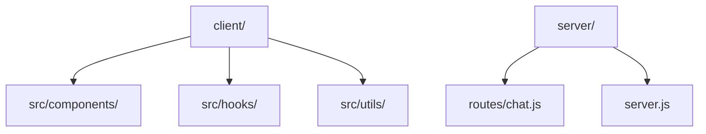

# 🤖 CyberBot

[](https://chat-bot-cyber.vercel.app/)

A modern, responsive AI chatbot application featuring a glassmorphic UI and real-time AI responses.

## 📂 File Structure



### Directory Details
- **`client/`**: React frontend powered by Vite
  - `src/components/`: UI modules (ChatContainer, InputBox, Background)
  - `src/hooks/`: Logic reuse (useChat)
- **`server/`**: Express backend
  - `routes/`: API endpoint definitions

## ☁️ Hosting Architecture

| Component | Provider | Config | Env Vars |
|-----------|----------|--------|----------|
| **Frontend** | [Vercel](https://vercel.com) | Static Site (Vite) | `VITE_API_URL` |
| **Backend** | [Render](https://render.com) | Node.js Service | `OPENROUTER_API_KEY`, `PORT` |

## 🛠️ Tech Stack

- **Frontend**: React, Tailwind CSS, Framer Motion
- **Backend**: Node.js, Express
- **AI Model**: GPT-3.5 Turbo (via OpenRouter)

## 🚀 Quick Start

1. **Clone & Setup**
   ```bash
   git clone <repo-url>
   cd Chat-Bot && cp .env.example .env
   ```

2. **Run Locally**
   ```bash
   # Terminal 1: Backend
   cd server && npm install && npm start

   # Terminal 2: Frontend
   cd ../client && npm install && npm run dev
   ```

## 📝 License

MIT License
